# Windows Server 2025 - Yazıcı ve Belge Hizmetleri Kurulum Rehberi

## 🎯 Genel Bakış

Bu rehber, Windows Server 2025 işletim sistemi üzerinde **Print and Document Services** rolünün kurulumunu ve ağ yazıcısı yapılandırmasını adım adım açıklamaktadır. Bu kurulum ile merkezi yazıcı yönetimi sağlayabilir, ağ yazıcılarını yönetebilir ve çoklu platform yazdırma desteği sunabilirsiniz.

**Önemli Not:** Bu kurulumdan önce Active Directory ve DNS yapılandırmasının tamamlanmış olması gerekmektedir.

---

## 📋 İçindekiler

- [Ön Gereksinimler ve Hazırlık](#ön-gereksinimler-ve-hazırlık)
- [Print and Document Services Kurulum Adımları](#-print-and-document-services-kurulum-adımları)
  - [Adım 1: Server Manager Ana Ekranı](#adım-1-server-manager-ana-ekranı)
  - [Adım 2: Print and Document Services Rol Seçimi](#adım-2-print-and-document-services-rol-seçimi)
  - [Adım 3: Yönetim Araçlarının Eklenmesi](#adım-3-yönetim-araçlarının-eklenmesi)
  - [Adım 4: Rol Servislerinin Seçimi](#adım-4-rol-servislerinin-seçimi)
  - [Adım 5: Kurulum Onayı ve Başlatma](#adım-5-kurulum-onayı-ve-başlatma)
- [Print Management Konsolu](#-print-management-konsolu)
  - [Adım 6: Print Management Konsoluna Erişim](#adım-6-print-management-konsoluna-erişim)
  - [Adım 7: Yazıcı Ekleme Menüsü](#adım-7-yazıcı-ekleme-menüsü)
- [Ağ Yazıcısı Yapılandırması](#-ağ-yazıcısı-yapılandırması)
  - [Adım 8: Kurulum Yöntemi Seçimi](#adım-8-kurulum-yöntemi-seçimi)
  - [Adım 9: Yazıcı Ağ Ayarları](#adım-9-yazıcı-ağ-ayarları)
  - [Adım 10: Yazıcı Sürücüsünü Yükleme](#adım-10-yazıcı-sürücüsünü-yükleme)
  - [Adım 11: Sürücü Model Seçimi](#adım-11-sürücü-model-seçimi)
  - [Adım 12: Yazıcı Paylaşım Ayarları](#adım-12-yazıcı-paylaşım-ayarları)
  - [Adım 13: Yazıcı Kurulumunun Tamamlanması](#adım-13-yazıcı-kurulumunun-tamamlanması)
- [Teknik Konfigürasyon](#-teknik-konfigürasyon)
- [Doğrulama ve Test](#-doğrulama-ve-test)
- [Sorun Giderme](#-sorun-giderme)
- [PowerShell ile Otomasyon](#-powershell-ile-otomasyon)
- [Güvenlik ve En İyi Uygulamalar](#-güvenlik-ve-en-iyi-uygulamalar)
- [Doküman Bilgileri](#-doküman-bilgileri)

---

## 🔰 Ön Gereksinimler ve Hazırlık

### Sistem Gereksinimleri
| Bileşen | Minimum | Önerilen |
|---------|---------|-----------|
| **İşletim Sistemi** | Windows Server 2025 | Windows Server 2025 |
| **Bellek** | 2 GB RAM | 4 GB RAM veya üzeri |
| **Disk Alanı** | 10 GB boş alan | 20 GB boş alan |
| **İşlemci** | 1.4 GHz 64-bit | 2 GHz veya üzeri |

### Yazılım Gereksinimleri
- [x] .NET Framework 4.8
- [x] Web Server (IIS) rolü
- [x] Remote Server Administration Tools
- [x] Active Directory etki alanına katılım

### Ağ Gereksinimleri
- Statik IP adresi yapılandırılmış sunucu
- Etki alanına katılım (DOMAIN.serifesien.local)
- Ağ yazıcısı erişimi (192.168.31.201)

### PowerShell Hazırlık Kontrolleri
```powershell
# Sistem gereksinimlerini kontrol etme
Get-ComputerInfo | Select-Object WindowsProductName, WindowsVersion, TotalPhysicalMemory, CsProcessors

# Ağ yapılandırmasını doğrulama
Get-NetIPConfiguration | Select-Object InterfaceAlias, IPv4Address, IPv4DefaultGateway

# DNS çözümlemesini test etme
Test-NetConnection -ComputerName "192.168.31.201" -InformationLevel Detailed

# Gerekli Windows özelliklerini kontrol etme
Get-WindowsFeature -Name Web-Server, NET-Framework-48-Core, RSAT*
```

---

## 🖥️ Print and Document Services Kurulum Adımları

### Adım 1: Server Manager Ana Ekranı

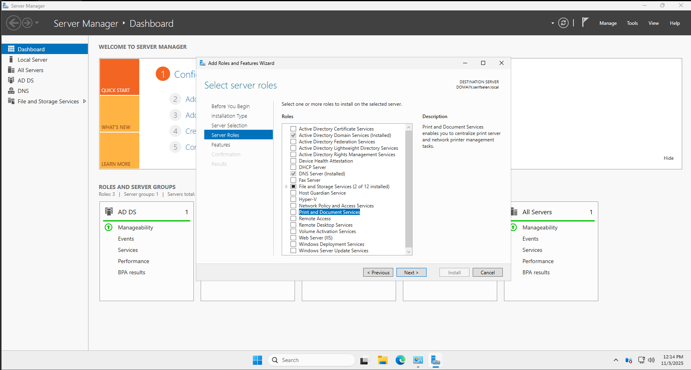

**Teknik Detaylar:**
- Server Manager, Windows Server'ın merkezi yönetim konsoludur
- Rol ve özellik ekleme işlemleri buradan başlatılır
- Dashboard'da sistem durumu ve yapılandırma seçenekleri görüntülenir

**PowerShell Alternatifi:**
```powershell
# Server Manager'ı PowerShell'den başlatma
servermanager

# Veya doğrudan rol ekleme sihirbazını başlatma
Install-WindowsFeature -Name Print-Services -IncludeManagementTools
```

✅ Print and Document Services kurulumuna başlamak için **"Add roles and features"** bağlantısına tıklayın.

---

### Adım 2: Print and Document Services Rol Seçimi

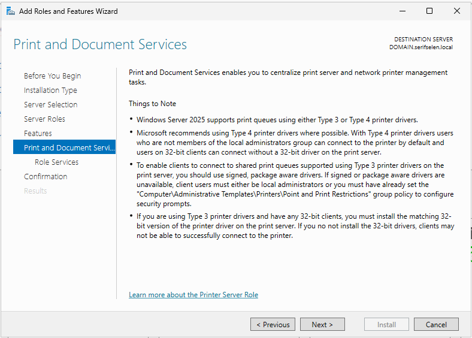

**Teknik Özellikler:**
- **Type 3 Drivers**: Geleneksel kernel-mode sürücüler
- **Type 4 Drivers**: Modern user-mode sürücüler (önerilen)
- **V4 Print Driver Model**: Daha güvenli ve kararlı

**Sürücü Türleri Karşılaştırması:**
| Özellik | Type 3 Sürücü | Type 4 Sürücü |
|---------|---------------|---------------|
| **Güvenlik Modeli** | Kernel Mode | User Mode |
| **Yönetici Hakları** | Gerekli | Gerekmez |
| **32/64-bit Desteği** | Ayrı sürücüler | Tek sürücü |
| **Dijital İmza** | Zorunlu değil | Zorunlu |

**PowerShell ile Rol Kontrolü:**
```powershell
# Print Services rol durumunu kontrol etme
Get-WindowsFeature -Name Print-Services

# Gerekli ön bağımlılıkları kontrol etme
Get-WindowsFeature -Name Web-Server, NET-Framework-48-Core
```

✅ **Print and Document Services** rolünü seçin ve **Next** butonuna tıklayın.

---

### Adım 3: Yönetim Araçlarının Eklenmesi

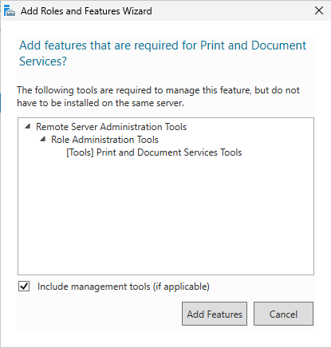

**Yönetim Araçları Bileşenleri:**
- **Print Management Console**: Merkezi yazıcı yönetimi
- **Print Service PowerShell Module**: PowerShell cmdlet'leri
- **Internet Printing Admin Tools**: Web tabanlı yönetim

**Teknik Detaylar:**
- RSAT (Remote Server Administration Tools) bileşenidir
- Yerel ve uzak sunucuları yönetmek için gereklidir
- Group Policy entegrasyonu sağlar

**PowerShell ile Araç Ekleme:**
```powershell
# Print ve Document Services yönetim araçlarını yükleme
Install-WindowsFeature -Name RSAT-Print-Services

# Tüm Print Services bileşenlerini yükleme
Install-WindowsFeature -Name Print-Services, Print-Server, Print-Internet, Print-LPD-Service -IncludeManagementTools
```

✅ **"Include management tools (if applicable)"** seçeneği otomatik işaretlenir.  
**Add Features** butonuna tıklayıp **Next** butonuna geçin.

---

### Adım 4: Rol Servislerinin Seçimi

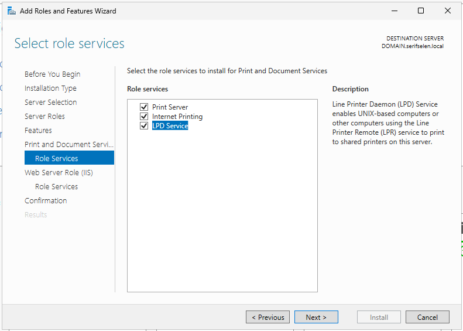

**Rol Servisleri Teknik Detayları:**

| Rol Servisi | ObjectClass | Kullanım Senaryosu | Port Gereksinimleri |
|-------------|-------------|-------------------|-------------------|
| **Print Server** | printServer | Temel yazıcı sunucusu | 135, 445, 9100 |
| **Internet Printing** | webService | Web yönetim arayüzü | 80, 443 |
| **LPD Service** | lpdService | UNIX/Linux desteği | 515 |

**LPD Service Teknik Özellikleri:**
- **Line Printer Daemon**: RFC 1179 protokolü
- **UNIX/Linux Uyumluluğu**: lp, lpr komutları
- **Queue Management**: Yazıcı kuyruk yönetimi

**PowerShell ile Rol Servisi Yükleme:**
```powershell
# Tüm Print Services bileşenlerini PowerShell ile yükleme
Install-WindowsFeature -Name `
    Print-Services, `
    Print-Server, `
    Print-Internet, `
    Print-LPD-Service, `
    RSAT-Print-Services

# Yükleme durumunu doğrulama
Get-WindowsFeature -Name Print* | Where-Object InstallState -eq "Installed"
```

✅ **Print Server**, **Internet Printing** ve **LPD Service** seçeneklerini işaretleyin.  
**Next** butonuna tıklayın.

---

### Adım 5: Kurulum Onayı ve Başlatma

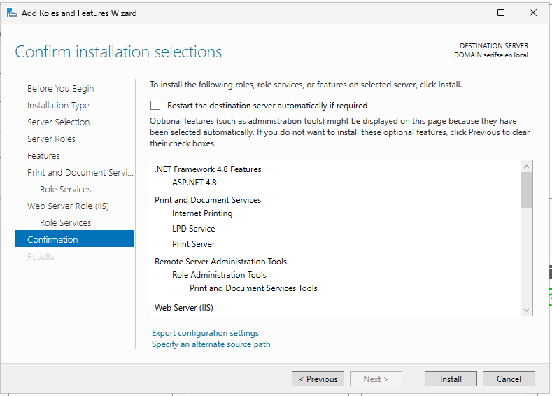

**Kurulum Bileşenleri Detayı:**
- **.NET Framework 4.8 Features**: Print servisleri için temel framework
- **ASP.NET 4.8**: Internet Printing için web altyapısı
- **Web Server (IIS)**: Internet Printing host servisi
- **Remote Server Administration Tools**: Uzak yönetim araçları

**Teknik Yapılandırma:**
```powershell
# Kurulum öncesi otomatik yeniden başlatma ayarı
$AutoRestart = $false  # Üretim ortamlarında manuel kontrol önerilir

# Alternatif kaynak yolu (gerekirse)
$SourcePath = "D:\Sources\SxS"  # Installation media yolu
```

**PowerShell ile Kurulum Onayı:**
```powershell
# Kurulum bileşenlerini doğrulama
$Features = @(
    "Print-Services",
    "Print-Server", 
    "Print-Internet",
    "Print-LPD-Service",
    "RSAT-Print-Services",
    "Web-Server",
    "NET-Framework-48-Core"
)

# Toplu kurulum
Install-WindowsFeature -Name $Features -IncludeManagementTools

# Kurulum sonrası servis durumunu kontrol etme
Get-Service -Name Spooler, HTTP | Select-Object Name, Status, StartType
```

✅ Kurulum özetini kontrol edin ve **Install** butonuna tıklayarak kurulumu başlatın.

---

## ⚙️ Print Management Konsolu

### Adım 6: Print Management Konsoluna Erişim

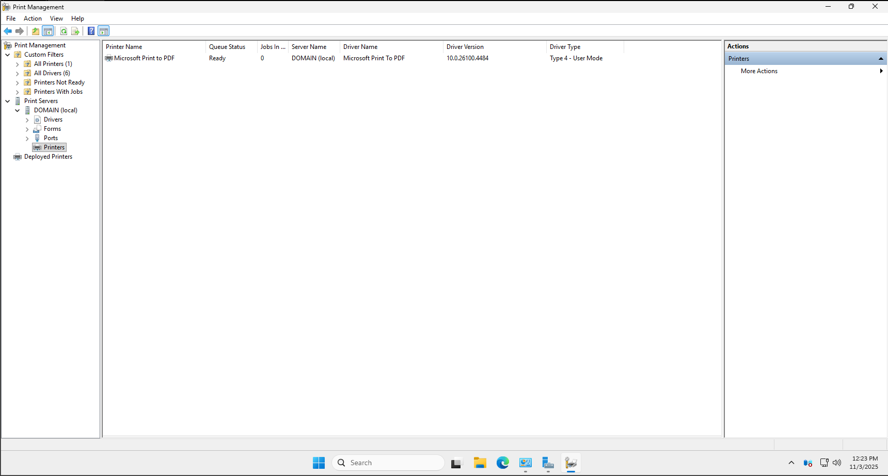

**Print Management Konsolu Bileşenleri:**

| Bölüm | Amaç | Teknik Detay |
|-------|------|-------------|
| **Custom Filters** | Yazıcı durum filtreleri | WMI queries |
| **Print Servers** | Sunucu yönetimi | Local/Remote server management |
| **Deployed Printers** | GPO ile dağıtılan yazıcılar | Group Policy Objects |
| **Drivers** | Sürücü yönetimi | Driver packages & versions |

**PowerShell ile Print Management:**
```powershell
# Print Management konsolunu açma
printmanagement.msc

# PowerShell Print Management modülünü yükleme
Import-Module PrintManagement

# Mevcut yazıcıları listeleme
Get-Printer | Format-Table Name, Type, PortName, DriverName, Shared
```

**Konsol Özellikleri:**
- **Real-time Monitoring**: Canlı yazıcı durumu izleme
- **Driver Management**: Sürücü versiyon yönetimi
- **Queue Management**: Yazdırma kuyruğu yönetimi
- **Security Delegation**: İzin delegasyonu

---

### Adım 7: Yazıcı Ekleme Menüsü

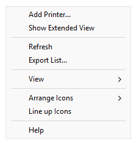

**Yazıcı Ekleme Yöntemleri:**
- **Network Printer Discovery**: Ağ taraması ile otomatik bulma
- **TCP/IP Printer**: Manuel IP adresi ile ekleme
- **Local Printer**: Yerel port üzerinden bağlantı

**PowerShell ile Yazıcı Keşfi:**
```powershell
# Ağdaki yazıcıları keşfetme
Get-WmiObject -Class Win32_Printer -ComputerName $env:COMPUTERNAME | 
Where-Object {$_.Network} | Select-Object Name, Location, PortName

# TCP/IP yazıcı portu oluşturma
Add-PrinterPort -Name "192.168.31.201" -PrinterHostAddress "192.168.31.201"
```

✅ Yeni ağ yazıcısı eklemek için **"Add Printer"** seçeneğine tıklayın.

---

## 🌐 Ağ Yazıcısı Yapılandırması

### Adım 8: Kurulum Yöntemi Seçimi

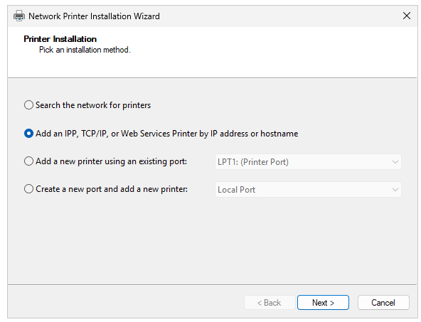

**Kurulum Yöntemleri Teknik Detayları:**

| Yöntem | Protokol | Port | Kullanım Senaryosu |
|--------|----------|------|-------------------|
| **Network Search** | WS-Discovery | 3702 | Otomatik bulma |
| **TCP/IP Printer** | RAW/Socket | 9100 | Doğrudan IP bağlantısı |
| **IPP Printer** | Internet Printing | 631 | Web servis entegrasyonu |
| **Web Services** | WSD API | 5357 | Windows Service Discovery |

**PowerShell ile TCP/IP Yazıcı Ekleme:**
```powershell
# TCP/IP yazıcı portu ve yazıcı oluşturma
$PrinterPort = "192.168.31.201"
$PrinterName = "NetworkPrinter-TCPIP"

# Port oluşturma
Add-PrinterPort -Name $PrinterPort -PrinterHostAddress $PrinterPort

# Yazıcı ekleme
Add-Printer -Name $PrinterName -PortName $PrinterPort -DriverName "Microsoft XPS Document Writer v4"
```

✅ **"Add an IPP, TCP/IP, or Web Services Printer by IP address or hostname"** seçeneğini işaretleyin.  
**Next** butonuna tıklayın.

---

### Adım 9: Yazıcı Ağ Ayarları


**TCP/IP Yazıcı Ayarları Teknik Detayları:**

| Ayar | Değer | Protokol Detayı |
|------|-------|-----------------|
| **Type of Device** | TCP/IP Device | Socket, LPR, IPP |
| **Hostname/IP** | 192.168.31.201 | IPv4 Address |
| **Port Name** | 192.168.31.201 | Otomatik oluşturulur |

**Port Tipleri ve Özellikleri:**
- **RAW Port (9100)**: Doğrudan veri aktarımı
- **LPR Port (515)**: Line Printer Remote protokolü
- **IPP Port (631)**: Internet Printing Protocol

**PowerShell ile Ağ Ayarları:**
```powershell
# Yazıcı port yapılandırması
$PortParams = @{
    Name = "192.168.31.201"
    PrinterHostAddress = "192.168.31.201"
    PortNumber = 9100
    Protocol = 1  # RAW protokolü
}

Add-PrinterPort @PortParams

# Port durumunu test etme
Test-NetConnection -ComputerName "192.168.31.201" -Port 9100
```

✅ Ağ ayarlarını girip **Next** butonuna tıklayın.

---

### Adım 10: Yazıcı Sürücüsünü Yükleme

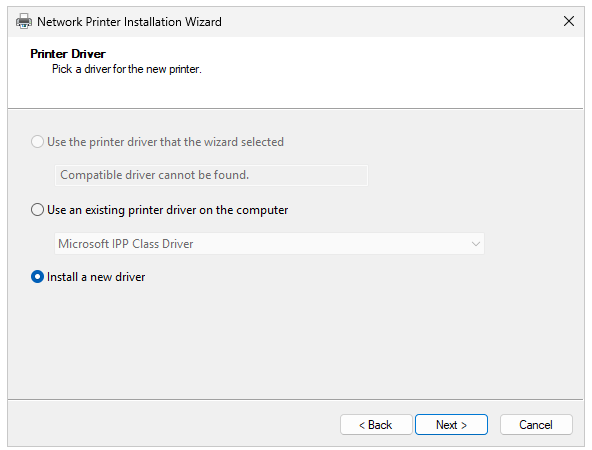

**Sürücü Seçenekleri Teknik Analizi:**

| Seçenek | Kullanım Senaryosu | Teknik Detay |
|---------|-------------------|-------------|
| **Wizard Selection** | Otomatik tespit | Plug and Play |
| **Existing Driver** | Önceden yüklenmiş | Shared printer driver |
| **New Driver** | Manuel seçim | Driver store'dan yükleme |

**Sürücü Türleri:**
- **Class Drivers**: Genel sürücü sınıfları
- **Manufacturer Drivers**: Üretici özel sürücüler
- **V4 Print Drivers**: User-mode sürücüler

**PowerShell ile Sürücü Yönetimi:**
```powershell
# Mevcut yazıcı sürücülerini listeleme
Get-PrinterDriver | Select-Object Name, Manufacturer, DriverVersion, PrinterEnvironment

# Yeni sürücü yükleme
Add-PrinterDriver -Name "Microsoft XPS Document Writer v4"

# Sürücü bilgilerini doğrulama
Get-PrinterDriver -Name "Microsoft XPS Document Writer v4" | Format-List *
```

✅ **"Install a new driver"** seçeneğini işaretleyip **Next** butonuna tıklayın.

---

### Adım 11: Sürücü Model Seçimi

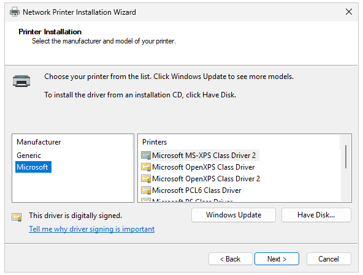

**Microsoft Sürücü Seçenekleri:**

| Sürücü Adı | Sürücü Türü | Format Desteği | Kullanım Senaryosu |
|------------|-------------|----------------|-------------------|
| **MS-XPS Class Driver 2** | Type 4 | XPS | Modern uygulamalar |
| **OpenXPS Class Driver** | Type 4 | OpenXPS | Standart belgeler |
| **PCL6 Class Driver** | Type 4 | PCL6 | Laser yazıcılar |

**Dijital İmza Önemi:**
- **Driver Authenticity**: Sürücü bütünlüğü garantisi
- **System Stability**: Sistem kararlılığı
- **Security Compliance**: Güvenlik uyumluluğu

**PowerShell ile Sürücü Seçimi:**
```powershell
# Kullanılabilir sürücüleri filtreleme
Get-PrinterDriver | Where-Object {$_.Manufacturer -eq "Microsoft"} | 
Select-Object Name, DriverVersion, ConfigFile, DataFile

# Belirli bir sürücüyü yükleme
$DriverParams = @{
    Name = "Microsoft XPS Document Writer v4"
    PrinterEnvironment = "Windows x64"
    DriverPath = "C:\Windows\System32\DriverStore\FileRepository\prnms003.inf_amd64_1234567890"
}

Add-PrinterDriver @DriverParams
```

✅ **Microsoft MS-XPS Class Driver 2** sürücüsünü seçip **Next** butonuna tıklayın.

---

### Adım 12: Yazıcı Paylaşım Ayarları

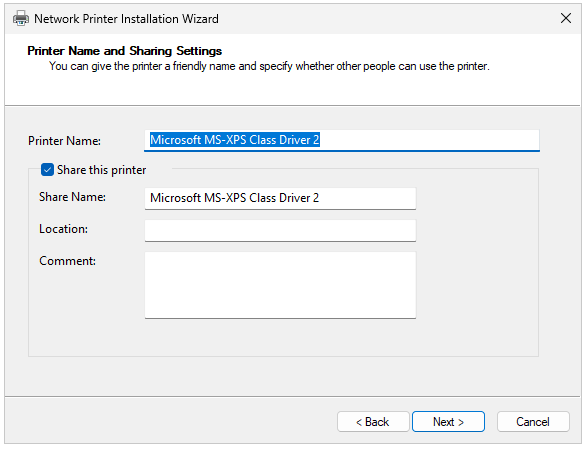

**Paylaşım Ayarları Teknik Detayları:**

| Ayar | Değer | ADSI Özelliği | Açıklama |
|------|-------|---------------|----------|
| **Printer Name** | Microsoft MS-XPS Class Driver 2 | cn | Common Name |
| **Share Name** | Microsoft MS-XPS Class Driver 2 | uncName | Ağ paylaşım yolu |
| **Location** | [Opsiyonel] | location | Fiziksel konum |
| **Comment** | [Opsiyonel] | description | Açıklama metni |

**Active Directory Entegrasyonu:**
- **AD Published**: Yazıcı AD'de yayınlanabilir
- **Security Descriptor**: Güvenlik tanımlayıcısı
- **Permission ACL**: Erişim kontrol listesi

**PowerShell ile Paylaşım Yapılandırması:**
```powershell
# Yazıcı oluşturma ve paylaşma
$PrinterParams = @{
    Name = "Microsoft MS-XPS Class Driver 2"
    PortName = "192.168.31.201"
    DriverName = "Microsoft XPS Document Writer v4"
    Shared = $true
    ShareName = "Microsoft MS-XPS Class Driver 2"
    Location = "IT Department - Floor 3"
    Comment = "Network XPS Printer for Document Services"
}

Add-Printer @PrinterParams

# Paylaşım izinlerini yapılandırma
$Printer = Get-Printer -Name "Microsoft MS-XPS Class Driver 2"
$Printer | Set-Printer -PermissionSDDL "O:SYG:SYD:(A;;0x3;;;AU)"
```

✅ Paylaşım ayarlarını girip **Next** butonuna tıklayın.

---

### Adım 13: Yazıcı Kurulumunun Tamamlanması

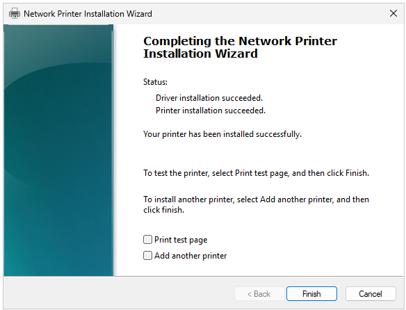

**Kurulum Sonuçları Teknik Detayları:**

| Bileşen | Durum | Log Konumu | Hata Kodu |
|---------|-------|------------|-----------|
| **Driver Installation** | Success | %SystemRoot%\System32\spool\drivers | 0x00000000 |
| **Printer Installation** | Success | %SystemRoot%\System32\spool\printers | 0x00000000 |
| **Port Creation** | Success | Registry: HKLM\SYSTEM\CurrentControlSet\Control\Print\Monitors | 0x00000000 |

**Test Senaryoları:**
- **Test Page**: Donanım ve sürücü testi
- **Network Connectivity**: Ağ erişim testi
- **Permission Test**: Güvenlik izinleri testi

**PowerShell ile Kurulum Doğrulama:**
```powershell
# Yazıcı kurulum durumunu kontrol etme
$Printer = Get-Printer -Name "Microsoft MS-XPS Class Driver 2" -ErrorAction SilentlyContinue

if ($Printer) {
    Write-Host "✅ Yazıcı başarıyla kuruldu:" -ForegroundColor Green
    $Printer | Format-Table Name, PortName, DriverName, Shared, PrinterStatus
    
    # Test sayfası yazdırma
    $TestPage = Get-WmiObject -Class Win32_Printer | Where-Object {$_.Name -eq "Microsoft MS-XPS Class Driver 2"}
    $TestPage.PrintTestPage()
} else {
    Write-Host "❌ Yazıcı kurulumu başarısız" -ForegroundColor Red
}

# Event log kayıtlarını kontrol etme
Get-WinEvent -LogName "Microsoft-Windows-PrintService/Operational" -MaxEvents 10 | 
Where-Object {$_.TimeCreated -gt (Get-Date).AddMinutes(-5)} | 
Format-Table TimeCreated, Id, LevelDisplayName, Message -Wrap
```

✅ Kurulumun başarıyla tamamlandığını doğrulayın ve **Finish** butonuna tıklayın.

---

## 🔧 Teknik Konfigürasyon

### Yazıcı Sürücü Mimarisi

```powershell
# Yazıcı sürücü mimarisi analizi
Get-PrinterDriver | Select-Object Name, Manufacturer, DriverVersion, ConfigFile, DataFile, DependentFiles | 
Export-Csv -Path "C:\PrinterDrivers_Inventory.csv" -NoTypeInformation

# Sürücü deposu temizleme (opsiyonel)
PrintManagement\Get-PrinterDriver | Where-Object {$_.Name -like "*Old*"} | Remove-PrinterDriver

# V4 Print Driver yapılandırması
Add-PrinterDriver -Name "Microsoft XPS Document Writer v4" -PrinterEnvironment "Windows x64"
```

### Grup Politikası Entegrasyonu

```powershell
# Yazıcı dağıtım politikaları
# Group Policy Management Console -> Computer Configuration -> Policies -> Windows Settings -> Deployed Printers

# PowerShell ile GPO yapılandırması
$GPO = New-GPO -Name "Enterprise Printer Deployment"
Set-GPPrefRegistryValue -Name "Enterprise Printer Deployment" -Context Computer -Key "HKLM\SOFTWARE\Policies\Microsoft\Windows NT\Printers" -ValueName "DeployedPrinters" -Type String -Value "\\$env:COMPUTERNAME\Microsoft MS-XPS Class Driver 2"
```

### Güvenlik Duvarı Yapılandırması

```powershell
# Print Services için güvenlik duvarı kuralları
$FirewallRules = @(
    @{Name="Print Spooler (RPC)"; Protocol="TCP"; Port=135},
    @{Name="Print Spooler (SMB)"; Protocol="TCP"; Port=445},
    @{Name="Print Raw (9100)"; Protocol="TCP"; Port=9100},
    @{Name="Internet Printing (HTTP)"; Protocol="TCP"; Port=80},
    @{Name="Internet Printing (HTTPS)"; Protocol="TCP"; Port=443},
    @{Name="LPD Service"; Protocol="TCP"; Port=515}
)

foreach ($Rule in $FirewallRules) {
    New-NetFirewallRule -DisplayName $Rule.Name -Direction Inbound -Protocol $Rule.Protocol -LocalPort $Rule.Port -Action Allow -Enabled True
}
```

---

## ✅ Doğrulama ve Test

### Temel Sağlık Kontrolleri

```powershell
# Yazıcı servis durumu kontrolü
$Services = @("Spooler", "HTTP", "HTTPSSL")
foreach ($Service in $Services) {
    $Status = Get-Service -Name $Service -ErrorAction SilentlyContinue
    if ($Status) {
        Write-Host "✅ $Service servisi: $($Status.Status)" -ForegroundColor Green
    } else {
        Write-Host "❌ $Service servisi bulunamadı" -ForegroundColor Red
    }
}

# Yazıcı durum raporu
$Printers = Get-Printer | Select-Object Name, Type, PortName, DriverName, Shared, PrinterStatus, JobCount
$Printers | Format-Table -AutoSize

# Yazıcı kuyruk durumu
Get-PrintJob | Group-Object PrinterName | Select-Object Name, Count | Format-Table
```

### Performans Testleri

```powershell
# Yazıcı performans sayaçları
$Counters = @(
    "\Print Queue(*)\Jobs",
    "\Print Queue(*)\Bytes Printed/sec", 
    "\Print Queue(*)\Jobs Spooling",
    "\Print Queue(*)\Max Jobs Spooling"
)

foreach ($Counter in $Counters) {
    try {
        $Value = Get-Counter -Counter $Counter -SampleInterval 2 -MaxSamples 3
        Write-Host "📊 $Counter : $($Value.CounterSamples[0].CookedValue)" -ForegroundColor Cyan
    } catch {
        Write-Host "⚠️  $Counter : Veri alınamadı" -ForegroundColor Yellow
    }
}
```

### Ağ Bağlantı Testleri

```powershell
# Yazıcı bağlantı testleri
$PrinterIP = "192.168.31.201"
$Ports = @(9100, 515, 80, 443, 135, 445)

Write-Host "🔍 Yazıcı bağlantı testleri:" -ForegroundColor Magenta

foreach ($Port in $Ports) {
    $Test = Test-NetConnection -ComputerName $PrinterIP -Port $Port -WarningAction SilentlyContinue
    if ($Test.TcpTestSucceeded) {
        Write-Host "✅ Port $Port : AÇIK" -ForegroundColor Green
    } else {
        Write-Host "❌ Port $Port : KAPALI" -ForegroundColor Red
    }
}
```

---

## 🛠️ Sorun Giderme

### Sık Karşılaşılan Sorunlar

```powershell
# Spooler servisi sorunları
function Repair-PrintSpooler {
    Write-Host "🛠️ Print Spooler onarılıyor..." -ForegroundColor Yellow
    
    # Spooler servisini durdur
    Stop-Service -Name Spooler -Force
    
    # Spool dosyalarını temizle
    Remove-Item -Path "C:\Windows\System32\spool\PRINTERS\*" -Force -ErrorAction SilentlyContinue
    
    # Spooler servisini başlat
    Start-Service -Name Spooler
    
    # Servis durumunu kontrol et
    $SpoolerStatus = Get-Service -Name Spooler
    Write-Host "🔄 Spooler servis durumu: $($SpoolerStatus.Status)" -ForegroundColor Cyan
}

# Yazıcı sürücü sorunları
function Reset-PrinterDrivers {
    Write-Host "🔄 Yazıcı sürücüleri sıfırlanıyor..." -ForegroundColor Yellow
    
    # Tüm yazıcıları kaldır
    Get-Printer | Remove-Printer -Confirm:$false
    
    # Tüm portları kaldır
    Get-PrinterPort | Remove-PrinterPort -Confirm:$false
    
    # Tüm sürücüleri kaldır (isteğe bağlı)
    # Get-PrinterDriver | Remove-PrinterDriver -Confirm:$false
    
    Write-Host "✅ Yazıcı yapılandırması sıfırlandı" -ForegroundColor Green
}
```

### Gelişmiş Diagnostik Araçları

```powershell
# Print Service event log analizi
function Get-PrintServiceEvents {
    $Events = Get-WinEvent -LogName "Microsoft-Windows-PrintService/Operational" -MaxEvents 50 | 
              Select-Object TimeCreated, Id, LevelDisplayName, Message
    
    $ErrorEvents = $Events | Where-Object {$_.LevelDisplayName -eq "Error"}
    $WarningEvents = $Events | Where-Object {$_.LevelDisplayName -eq "Warning"}
    
    Write-Host "📋 Son Print Service olayları:" -ForegroundColor Magenta
    Write-Host "   Hata sayısı: $($ErrorEvents.Count)" -ForegroundColor Red
    Write-Host "   Uyarı sayısı: $($WarningEvents.Count)" -ForegroundColor Yellow
    
    return $Events
}

# Yazıcı konfigürasyon yedekleme
function Backup-PrinterConfig {
    $BackupPath = "C:\PrinterConfigBackup"
    if (!(Test-Path $BackupPath)) {
        New-Item -ItemType Directory -Path $BackupPath -Force
    }
    
    # Yazıcı bilgilerini yedekle
    Get-Printer | Export-Clixml -Path "$BackupPath\Printers.xml"
    Get-PrinterPort | Export-Clixml -Path "$BackupPath\PrinterPorts.xml"
    Get-PrinterDriver | Export-Clixml -Path "$BackupPath\PrinterDrivers.xml"
    
    Write-Host "💾 Yazıcı konfigürasyonu yedeklendi: $BackupPath" -ForegroundColor Green
}
```

---

## ⚡ PowerShell ile Otomasyon

### Toplu Yazıcı Dağıtımı

```powershell
# CSV dosyasından toplu yazıcı ekleme
function Deploy-PrintersFromCSV {
    param(
        [string]$CSVPath = "C:\PrinterDeployment.csv"
    )
    
    if (Test-Path $CSVPath) {
        $Printers = Import-Csv -Path $CSVPath
        
        foreach ($Printer in $Printers) {
            try {
                # Port oluştur
                if (!(Get-PrinterPort -Name $Printer.IPAddress -ErrorAction SilentlyContinue)) {
                    Add-PrinterPort -Name $Printer.IPAddress -PrinterHostAddress $Printer.IPAddress
                }
                
                # Sürücü kontrol et
                if (!(Get-PrinterDriver -Name $Printer.DriverName -ErrorAction SilentlyContinue)) {
                    Add-PrinterDriver -Name $Printer.DriverName
                }
                
                # Yazıcı ekle
                $PrinterParams = @{
                    Name = $Printer.PrinterName
                    PortName = $Printer.IPAddress
                    DriverName = $Printer.DriverName
                    Shared = [bool]::Parse($Printer.Shared)
                    ShareName = if ([bool]::Parse($Printer.Shared)) { $Printer.ShareName } else { $null }
                    Location = $Printer.Location
                    Comment = $Printer.Comment
                }
                
                Add-Printer @PrinterParams
                Write-Host "✅ $($Printer.PrinterName) eklendi" -ForegroundColor Green
                
            } catch {
                Write-Host "❌ $($Printer.PrinterName) eklenemedi: $($_.Exception.Message)" -ForegroundColor Red
            }
        }
    } else {
        Write-Host "❌ CSV dosyası bulunamadı: $CSVPath" -ForegroundColor Red
    }
}

# Örnek CSV formatı:
# PrinterName,IPAddress,DriverName,Shared,ShareName,Location,Comment
# FinancePrinter,192.168.1.100,Microsoft XPS Document Writer v4,True,FinancePrinter,Finance Department,Finance documents
```

### Monitoring ve Raporlama

```powershell
# Yazıcı kullanım raporu
function Get-PrinterUsageReport {
    $Report = @()
    
    $Printers = Get-Printer | Select-Object Name, PortName, DriverName, Shared, PrinterStatus
    
    foreach ($Printer in $Printers) {
        $Jobs = Get-PrintJob -PrinterName $Printer.Name
        $JobCount = $Jobs.Count
        
        $Report += [PSCustomObject]@{
            PrinterName = $Printer.Name
            Status = $Printer.PrinterStatus
            JobCount = $JobCount
            Driver = $Printer.DriverName
            Shared = $Printer.Shared
            Port = $Printer.PortName
        }
    }
    
    $Report | Sort-Object JobCount -Descending | Format-Table -AutoSize
    
    # CSV olarak dışa aktar
    $Report | Export-Csv -Path "C:\PrinterUsageReport_$(Get-Date -Format 'yyyyMMdd_HHmmss').csv" -NoTypeInformation
    
    return $Report
}

# Otomatik bakım scripti
function Invoke-PrinterMaintenance {
    Write-Host "🔧 Yazıcı bakım işlemleri başlatılıyor..." -ForegroundColor Yellow
    
    # Eski yazdırma işlerini temizle (24 saatten eski)
    $OldJobs = Get-PrintJob | Where-Object {$_.SubmittedTime -lt (Get-Date).AddHours(-24)}
    if ($OldJobs) {
        $OldJobs | Remove-PrintJob
        Write-Host "🗑️  $($OldJobs.Count) eski yazdırma işi temizlendi" -ForegroundColor Green
    }
    
    # Bozuk yazıcıları kontrol et
    $ProblematicPrinters = Get-Printer | Where-Object {$_.PrinterStatus -ne "Normal"}
    if ($ProblematicPrinters) {
        Write-Host "⚠️  Problemli yazıcılar bulundu:" -ForegroundColor Yellow
        $ProblematicPrinters | Format-Table Name, PrinterStatus
    }
    
    # Spooler servisini yeniden başlat (gerekirse)
    if ($ProblematicPrinters) {
        Repair-PrintSpooler
    }
    
    Write-Host "✅ Bakım işlemleri tamamlandı" -ForegroundColor Green
}
```

---

## 🔒 Güvenlik ve En İyi Uygulamalar

### Güvenlik Yapılandırması

```powershell
# Yazıcı güvenlik politikaları
function Set-PrinterSecurity {
    Write-Host "🔒 Yazıcı güvenlik yapılandırması uygulanıyor..." -ForegroundColor Yellow
    
    # Varsayılan yazıcı izinlerini yapılandır
    $Printers = Get-Printer
    
    foreach ($Printer in $Printers) {
        # Yönetici tam kontrol
        $Printer | Set-Printer -PermissionSDDL "O:SYG:SYD:(A;;0xF;;;SY)(A;;0xF;;;BA)(A;;0x3;;;AU)"
        
        # Yazıcı ayarlarını güvenli hale getir
        $Printer | Set-Printer -Published $false  # AD'de yayınlama (isteğe bağlı)
    }
    
    # Point and Print restrictions
    Set-ItemProperty -Path "HKLM:\SOFTWARE\Policies\Microsoft\Windows NT\Printers\PointAndPrint" -Name "RestrictDriverInstallationToAdministrators" -Value 1 -Type DWord
    Set-ItemProperty -Path "HKLM:\SOFTWARE\Policies\Microsoft\Windows NT\Printers\PointAndPrint" -Name "NoWarningNoElevationOnInstall" -Value 0 -Type DWord
    
    Write-Host "✅ Güvenlik yapılandırması tamamlandı" -ForegroundColor Green
}

# Yazıcı erişim denetimi
function Audit-PrinterAccess {
    # Yazıcı erişim denetimini etkinleştir
    auditpol /set /subcategory:"Other Object Access Events" /success:enable /failure:enable
    
    Write-Host "📊 Yazıcı erişim denetimi etkinleştirildi" -ForegroundColor Green
}
```

### En İyi Uygulama Kontrolleri

```powershell
# Yazıcı en iyi uygulama kontrol listesi
function Test-PrinterBestPractices {
    $Results = @()
    
    # 1. Type 4 sürücü kullanımı
    $V4Drivers = Get-PrinterDriver | Where-Object {$_.Name -like "*v4*"}
    $V4Ratio = if ($V4Drivers.Count -gt 0) { ($V4Drivers.Count / (Get-PrinterDriver).Count) * 100 } else { 0 }
    $Results += [PSCustomObject]@{
        Check = "Type 4 Sürücü Kullanımı"
        Status = if ($V4Ratio -ge 80) { "✅" } else { "⚠️" }
        Details = "$([math]::Round($V4Ratio, 2))% Type 4 sürücü kullanılıyor"
    }
    
    # 2. Paylaşım güvenliği
    $UnsecuredPrinters = Get-Printer | Where-Object {$_.Shared -eq $true -and $_.Name -notlike "*Secure*"}
    $Results += [PSCustomObject]@{
        Check = "Paylaşım Güvenliği"
        Status = if ($UnsecuredPrinters.Count -eq 0) { "✅" } else { "⚠️" }
        Details = "$($UnsecuredPrinters.Count) güvenli olmayan paylaşım"
    }
    
    # 3. Spooler servis durumu
    $SpoolerStatus = Get-Service -Name Spooler
    $Results += [PSCustomObject]@{
        Check = "Spooler Servis Durumu"
        Status = if ($SpoolerStatus.Status -eq "Running") { "✅" } else { "❌" }
        Details = "Spooler: $($SpoolerStatus.Status)"
    }
    
    # 4. Güncel sürücüler
    $OldDrivers = Get-PrinterDriver | Where-Object {$_.DriverVersion -lt "10.0.0.0"}
    $Results += [PSCustomObject]@{
        Check = "Güncel Sürücüler"
        Status = if ($OldDrivers.Count -eq 0) { "✅" } else { "⚠️" }
        Details = "$($OldDrivers.Count) güncel olmayan sürücü"
    }
    
    $Results | Format-Table -AutoSize
    return $Results
}
```

---

## 📜 Doküman Bilgileri

| Özellik | Değer |
|---------|-------|
| **Yazar** | Serif SELEN |
| **Tarih** | Aralık 2024 |
| **Versiyon** | 2.0 |
| **Platform** | VMware Workstation Pro 17 |
| **İşletim Sistemi** | Windows Server 2025 Standard Evaluation |
| **Etki Alanı Adı** | `DOMAIN.serifesien.local` |
| **Yazıcı IP** | `192.168.31.201` |
| **Test Yazıcı** | Microsoft MS-XPS Class Driver 2 |
| **Lisans** | Evaluation (180 gün) |

**Kurulan Bileşenler:**
- ✅ Print and Document Services
- ✅ Print Server
- ✅ Internet Printing
- ✅ LPD Service
- ✅ Print Management Tools
- ✅ Web Server (IIS)
- ✅ .NET Framework 4.8

**Değişiklik Geçmişi:**
- **v2.0**: PowerShell otomasyon, teknik detaylar, sorun giderme bölümleri eklendi
- **v1.0**: Temel kurulum adımları ve görsel rehber

> ⚠️ **Önemli Not:** Bu doküman eğitim ve test ortamları için hazırlanmıştır. Üretim ortamlarında lisanslı yazılım ve güvenlik önlemleri kullanılmalıdır.

> 📧 **Destek İçin**: [mserifselen@gmail.com](mailto:mserifselen@gmail.com)  
> 🔗 **GitHub Repository**: [https://github.com/serifselen/](https://github.com/serifselen/)
