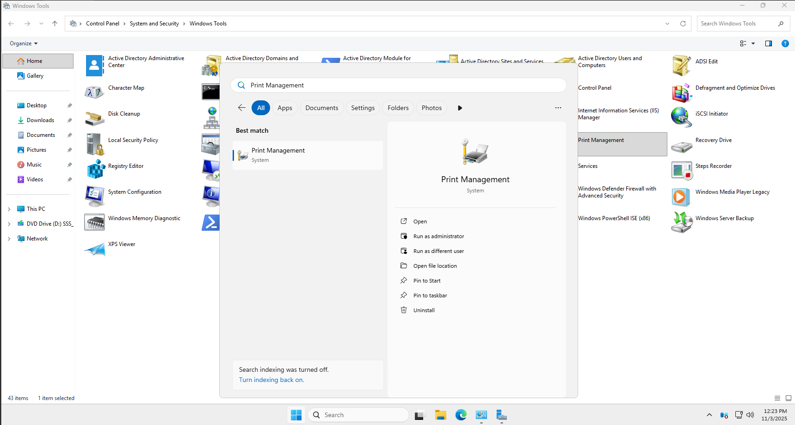

# 🖨️ Windows Server 2025 Üzerinde Print and Document Services Kurulumu ve Yazıcı Ekleme

> ⚠️ **Not:** Bu rehber, **Windows Server 2025 Standard Evaluation** sürümüne göre hazırlanmıştır. Üretim ortamlarında lisanslı sürüm kullanılmalıdır.

---

## 📑 İçindekiler
- [Adım 1: Server Manager üzerinden "Add Roles and Features" Sihirbazı](#-adım-1-server-manager-üzerinden-add-roles-and-features-sihirbazı)
- [Adım 2: Print and Document Services Rolünün Seçilmesi](#-adım-2-print-and-document-services-rolünün-seçilmesi)
- [Adım 3: Rol Hizmetlerinin (Role Services) Seçilmesi](#-adım-3-rol-hizmetlerinin-role-services-seçilmesi)
- [Adım 4: Kurulum Öncesi Bilgilendirme Ekranı](#-adım-4-kurulum-öncesi-bilgilendirme-ekranı)
- [Adım 5: Kurulum Onayı ve Yönetim Araçlarının Dahil Edilmesi](#-adım-5-kurulum-onayı-ve-yönetim-araçlarının-dahil-edilmesi)
- [Adım 6: Print Management Aracına Erişim](#-adım-6-print-management-aracına-erişim)
- [Adım 7: Add Printer Menüsü](#-adım-7-add-printer-menüsü)
- [Adım 8: Ağ Yazıcısı Türünün Seçilmesi](#-adım-8-ağ-yazıcısı-türünün-seçilmesi)
- [Adım 9: Yazıcı IP Adresinin Girilmesi](#-adım-9-yazıcı-ip-adresinin-girilmesi)
- [Adım 10: Sürücü Seçimi](#-adım-10-sürücü-seçimi)
- [Adım 11: Sürücü Yükleme Yöntemi](#-adım-11-sürücü-yükleme-yöntemi)
- [Adım 12: Yazıcı Adı ve Paylaşım Ayarları](#-adım-12-yazıcı-adı-ve-paylaşım-ayarları)
- [Adım 13: Kurulum Tamamlama](#-adım-13-kurulum-tamamlama)
- [Adım 14: Print Management'te Yazıcının Görünümü](#-adım-14-print-managementte-yazıcının-görünümü)

---

## 🚀 Adım 1: Server Manager üzerinden "Add Roles and Features" Sihirbazı

**Açıklama:**  
Server Manager ana ekranında:
- **QUICK START** bölümü görünür
- **Add roles and features** bağlantısı seçilmelidir

✅ AD DS kurulumuna başlamak için **"Add roles and features"** bağlantısına tıklayın.

> 💡 **Pro Tip:** Server Manager, tüm Windows Server rollerinin ve özelliklerinin yönetildiği merkezi araçtır.

---

## 🧩 Adım 2: Print and Document Services Rolünün Seçilmesi

**Açıklama:**  
**Server Roles** ekranında:
- Sol panelde roller listesi görünür
- **Print and Document Services** rolü seçilir
- Açılan **"Add features required"** penceresinde **Add Features** butonuna tıklanır

✅ **Print and Document Services** rolünü seçtikten sonra **Next** butonuna tıklayın.

---

## 📄 Adım 3: Rol Hizmetlerinin (Role Services) Seçilmesi

**Açıklama:**  
**Role Services** seçim ekranında:
- **Print Server** (temel servis)
- **LPD Service** (Linux/Unix desteği)
- **Internet Printing** (web üzerinden yazdırma)
- **Fax Server** (opsiyonel)

✅ Gerekli tüm hizmetleri seçtikten sonra **Next** butonuna tıklayın.

---

## ⚠️ Adım 4: Kurulum Öncesi Bilgilendirme Ekranı

**Açıklama:**  
**Things to Note** ekranında:
- Type 3 ve Type 4 sürücü farkları
- 32-bit istemci desteği
- Güvenlik ve performans önerileri

✅ Bu ekran sadece bilgilendirme amaçlıdır. **Next** butonuna tıklayarak devam edin.

---

## ✅ Adım 5: Kurulum Onayı ve Yönetim Araçlarının Dahil Edilmesi

**Açıklama:**  
**Confirm installation selections** ekranında:
- **"Include management tools"** seçeneği işaretli olmalıdır
- Yüklenecek bileşenler listelenir:
  - Print and Document Services
  - .NET Framework 4.8
  - Yönetim araçları

➡️ **Install** butonuna tıklayarak kurulumu başlatın.

---

## 🔍 Adım 6: Print Management Aracına Erişim

**Açıklama:**  
Kurulum tamamlandıktan sonra:
- **Start Menu** üzerinden **Print Management** aranır
- Alternatif: `Win + R` > `printmanagement.msc`

✅ Araç başarıyla açıldığında sol panelde:
- Print Servers
- All Drivers
- Forms
- Ports
- Printers

bölümleri görüntülenir.

---

## ➕ Adım 7: Add Printer Menüsü

**Açıklama:**  
Print Management ekranında:
- Sol panelde **Printers** bölümüne sağ tıklayın
- Açılan menüde **Add Printer...** seçeneği seçilir

✅ Bu işlem, yeni yazıcı ekleme sihirbazını başlatır.

---

## 🌐 Adım 8: Ağ Yazıcısı Türünün Seçilmesi

**Açıklama:**  
**Network Printer Installation Wizard** ekranında:
- **Add a printer using a TCP/IP address or hostname** seçeneği seçilir
- Diğer seçenekler:
  - Search the network for printers
  - Add a local printer
  - Add a printer using an existing port

✅ **Next** butonuna tıklayarak devam edin.

---

## 📍 Adım 9: Yazıcı IP Adresinin Girilmesi

**Açıklama:**  
**Add Printer** ekranında:
- **Hostname or IP address**: `192.168.31.201` (yazıcının IP'si)
- **Port Name**: `IP_192.168.31.201` (otomatik oluşturulur)
- **Auto detect printer driver** seçeneği işaretli

✅ Yazıcı IP'nizi doğru girdiğinizden emin olun. **Next** butonuna tıklayın.

---

## 🖨️ Adım 10: Sürücü Seçimi

**Açıklama:**  
**Install the printer driver** ekranında:
- **Manufacturer**: `Microsoft`
- **Printers**: `Microsoft MS-XPS Class Driver 2`
- Bu, sanal XPS yazıcı sürücüsüdür (test amaçlı)

✅ Gerçek yazıcı için üreticinin sitesinden indirdiğiniz sürücüyü seçin. **Next** butonuna tıklayın.

---

## 🛠️ Adım 11: Sürücü Yükleme Yöntemi

**Açıklama:**  
Sistem sürücüyü bulamadığında:
- **Install a new driver** seçeneği seçilir
- **Have Disk** butonu ile özel sürücü yüklenebilir

✅ Gerçek yazıcılar için **Have Disk** ile üreticiden indirdiğiniz `.inf` dosyasını seçin.

---

## 🏷️ Adım 12: Yazıcı Adı ve Paylaşım Ayarları

**Açıklama:**  
**Printer name and sharing settings** ekranında:
- **Printer name**: `Microsoft MS-XPS Class Driver 2`
- **Share this printer**: ✅ İşaretli (ağda paylaşılacaksa)
- **Share name**: `XPS_PRINTER`
- **Location**: `Server Room`
- **Comment**: `Test yazıcı - sanal`

✅ Paylaşım ayarlarını doğru yapılandırdıktan sonra **Next** butonuna tıklayın.

---

## ✅ Adım 13: Kurulum Tamamlama

**Açıklama:**  
**Completing the Network Printer Installation Wizard** ekranında:
- **Print test page** seçeneği işaretlenebilir
- Kurulum tamamlandıktan sonra **Finish** butonuna tıklanır

✅ Test sayfası basarak yazıcının çalıştığını doğrulayın.

---

## 📊 Adım 14: Print Management'te Yazıcının Görünümü

**Açıklama:**  
Print Management ekranında:
- Yeni eklenen yazıcı **Printers** bölümünde listelenir
- **Status**: `Ready`
- **Jobs in Queue**: `0`
- **Driver**: `Microsoft MS-XPS Class Driver 2`

✅ Yazıcı başarıyla eklenmiş ve kullanıma hazırdır.

---

## ✅ Sonuç
- Print and Document Services rolü başarıyla kuruldu
- Ağ yazıcısı sisteme entegre edildi
- Yazıcı paylaşılarak ağ kullanıcılarına açıldı
- Test sayfası başarıyla basıldı

> 📝 **Bu doküman, eğitim ve test ortamları için hazırlanmıştır. Üretimde lisanslı yazılım ve güvenlik önlemleri kullanılmalıdır.**
